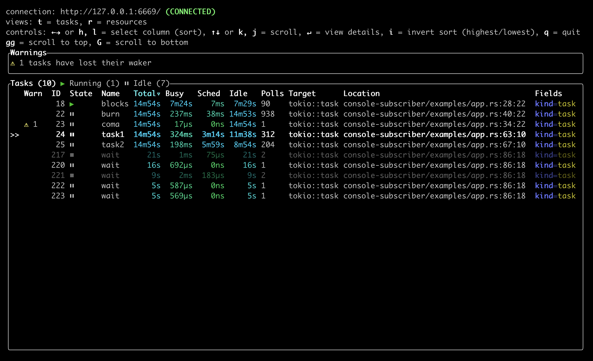
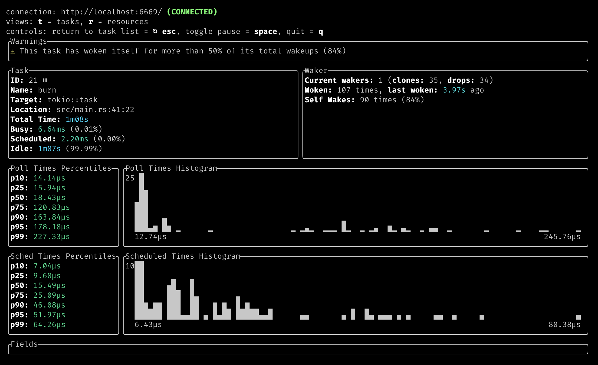

# tokio-console

[][main-docs]
[![MIT licensed][mit-badge]][mit-url]
[![Build Status][actions-badge]][actions-url]
[![Discord chat][discord-badge]][discord-url]

[Chat][discord-url] | [API Documentation (`main` branch)][main-docs]

[main-docs]: https://tokio-console.netlify.app
[mit-badge]: https://img.shields.io/badge/license-MIT-blue.svg
[mit-url]: LICENSE
[actions-badge]: https://github.com/tokio-rs/console/workflows/CI/badge.svg
[actions-url]:https://github.com/tokio-rs/console/actions?query=workflow%3ACI
[discord-badge]: https://img.shields.io/discord/500028886025895936?logo=discord&label=discord&logoColor=white
[discord-url]: https://discord.gg/EeF3cQw

## what's all this, then?

this repository contains an implementation of TurboWish/tokio-console,
a diagnostics and debugging tool for asynchronous Rust programs. the diagnostic
toolkit consists of multiple components:

* a **wire protocol for streaming diagnostic data** from instrumented applications
  to diagnostic tools. the wire format is defined using [gRPC] and [protocol
  buffers], for efficient transport on the wire and interoperability between
  different implementations of data producers and consumers.

  the [`console-api`] crate contains generated code for this wire format for
  projects using the [`tonic`] gRPC implementation. additionally, projects using
  other gRPC code generators (including those in other languages!) can depend on
  [the protobuf definitions] themselves.

* **instrumentation for collecting diagnostic data** from a process and exposing
  it over the wire format. the [`console-subscriber`] crate in this repository
  contains **an implementation of the instrumentation-side API as a
  [`tracing-subscriber`] [`Layer`]**, for projects using [Tokio] and
  [`tracing`].

* tools for **displaying and exploring diagnostic data**, implemented as gRPC
  clients using the console wire protocol. the [`tokio-console`] crate
  implements an **an interactive command-line tool** that consumes this data,
  but **other implementations**, such as graphical or web-based tools, are
  also possible.

[gRPC]: https://grpc.io/
[protocol buffers]: https://developers.google.com/protocol-buffers
[the protobuf definitions]: https://github.com/tokio-rs/console/tree/main/console-api/proto
[`tonic`]: https://lib.rs/crates/tonic
[Tokio]: https://tokio.rs

## extremely cool and amazing screenshots

wow! whoa! it's like `top(1)` for tasks!



viewing details for a single task:



## on the shoulders of giants

the console is **part of a much larger effort** to improve debugging tooling for
async Rust. **a [2019 Google Summer of Code project][gsoc] by Matthias Prechtl**
([**@matprec**]) implemented an initial prototype, with a focus on interactive log
viewing. more recently, both **the [Tokio team][tokio-blog] and the [async
foundations working group][shiny-future]** have made diagnostics and debugging
tools a priority for async Rust in 2021 and beyond. in particular, a
[series][tw-1] of [blog][tw-2] [posts][tw-3] by [**@pnkfelix**] lay out much of
the vision that this project seeks to eventually implement.

furthermore, we're indebted to our antecedents in other programming languages
and environments for inspiration. this includes tools and systems such as
[`pprof`], Unix [`top(1)`] and [`htop(1)`], XCode's [Instruments], and many
others.

[gsoc]: https://github.com/tokio-rs/console-gsoc
[tokio-blog]: https://tokio.rs/blog/2020-12-tokio-1-0#tracing
[shiny-future]: https://rust-lang.github.io/wg-async/vision/submitted_stories/shiny_future/barbara_makes_a_wish.html
[tw-1]: http://blog.pnkfx.org/blog/2021/04/26/road-to-turbowish-part-1-goals/
[tw-2]: http://blog.pnkfx.org/blog/2021/04/27/road-to-turbowish-part-2-stories/
[tw-3]: http://blog.pnkfx.org/blog/2021/05/03/road-to-turbowish-part-3-design/
[`pprof`]: https://github.com/google/pprof
[`top(1)`]: https://man7.org/linux/man-pages/man1/top.1.html
[`htop(1)`]: https://htop.dev/
[Instruments]: https://developer.apple.com/library/archive/documentation/ToolsLanguages/Conceptual/Xcode_Overview/MeasuringPerformance.html
[**@matprec**]: https://github.com/matprec
[**@pnkfelix**]: https://github.com/pnkfelix

## using it

### instrumenting your program

to **instrument an application using Tokio**, add a dependency on the
[`console-subscriber`] crate, and **add this one-liner** to the top of your
`main` function:

```rust
console_subscriber::init();
```

notes:

* in order to collect task data from Tokio, **the `tokio_unstable` cfg must be
  enabled**. for example, you could build your project with

  ```shell
  RUSTFLAGS="--cfg tokio_unstable" cargo build
  ```

  or add the following to your `.cargo/config.toml` file:

  ```toml
  [build]
  rustflags = ["--cfg", "tokio_unstable"]
  ```

  For more information on the appropriate location of your `.cargo/config.toml` file,
  especially when using workspaces, see the
  [console-subscriber readme](console-subscriber/README.md#enabling-tokio-instrumentation).
* the `tokio` and `runtime` [`tracing` targets] must be enabled at the [`TRACE`
  level].

  * if you're using the [`console_subscriber::init()`][init] or
  [`console_subscriber::Builder`][builder] APIs, these targets are enabled
  automatically.

  * if you are manually configuring the `tracing` subscriber using the
  [`EnvFilter`] or [`Targets`] filters from [`tracing-subscriber`], add
  `"tokio=trace,runtime=trace"` to your filter configuration.

  * also, ensure you have not enabled any of the [compile time filter
    features][compile_time_filters] in your `Cargo.toml`.

### running the console

to **run the console command-line tool**, install `tokio-console` from [crates.io](https://crates.io/crates/tokio-console)

```shell
cargo install --locked tokio-console
```

and run locally

```shell
tokio-console
```

> **alternative method:** run the tool from a local checkout of this repository
>
> ```shell
> $ cargo run
> ```

by default, this will attempt to connect to an instrumented application running
on localhost on port 6669. if the application is running somewhere else, or is
serving the console endpoint on a different port, a target address can be passed
as an argument to the console (either as an `<IP>:<PORT>` or
`<DNS_NAME>:<PORT>`). for example:

```shell
cargo run -- http://my.great.console.app.local:5555
```

The console command-line tool supports a number of additional flags to configure
its behavior. The `help` command will print a list of supported command-line
flags and arguments:

```console
$ tokio-console --help
The Tokio console: a debugger for async Rust.

Usage: tokio-console[EXE] [OPTIONS] [TARGET_ADDR] [COMMAND]

Commands:
  gen-config
          Generate a `console.toml` config file with the default
          configuration values, overridden by any provided command-line
          arguments
  gen-completion
          Generate shell completions
  help
          Print this message or the help of the given subcommand(s)

Arguments:
  [TARGET_ADDR]
          The address of a console-enabled process to connect to.
          
          This may be an IP address and port, or a DNS name.
          
          On Unix platforms, this may also be a URI with the `file`
          scheme that specifies the path to a Unix domain socket, as in
          `file://localhost/path/to/socket`.
          
          [default: http://127.0.0.1:6669]

Options:
      --log <LOG_FILTER>
          Log level filter for the console's internal diagnostics.
          
          Logs are written to a new file at the path given by the
          `--log-dir` argument (or its default value), or to the system
          journal if `systemd-journald` support is enabled.
          
          If this is set to 'off' or is not set, no logs will be
          written.
          
          [default: off]
          
          [env: RUST_LOG=]

  -W, --warn <WARNINGS>...
          Enable lint warnings.
          
          This is a comma-separated list of warnings to enable.
          
          Each warning is specified by its name, which is one of:
          
          * `self-wakes` -- Warns when a task wakes itself more than a
          certain percentage of its total wakeups. Default percentage is
          50%.
          
          * `lost-waker` -- Warns when a task is dropped without being
          woken.
          
          * `never-yielded` -- Warns when a task has never yielded.
          
          [default: self-wakes lost-waker never-yielded]
          [possible values: self-wakes, lost-waker, never-yielded]

  -A, --allow <ALLOW_WARNINGS>...
          Allow lint warnings.
          
          This is a comma-separated list of warnings to allow.
          
          Each warning is specified by its name, which is one of:
          
          * `all` -- Allow all warnings.
          
          * `self-wakes` -- Warns when a task wakes itself more than a
          certain percentage of its total wakeups. Default percentage is
          50%.
          
          * `lost-waker` -- Warns when a task is dropped without being
          woken.
          
          * `never-yielded` -- Warns when a task has never yielded.
          
          [possible values: all, self-wakes, lost-waker, never-yielded]

      --log-dir <LOG_DIRECTORY>
          Path to a directory to write the console's internal logs to.
          
          [default: /tmp/tokio-console/logs]

      --lang <LANG>
          Overrides the terminal's default language
          
          [env: LANG=en_US.UTF-8]

      --ascii-only <ASCII_ONLY>
          Explicitly use only ASCII characters
          
          [possible values: true, false]

      --no-colors
          Disable ANSI colors entirely

      --colorterm <truecolor>
          Overrides the value of the `COLORTERM` environment variable.
          
          If this is set to `24bit` or `truecolor`, 24-bit RGB color
          support will be enabled.
          
          [env: COLORTERM=truecolor]
          [possible values: 24bit, truecolor]

      --palette <PALETTE>
          Explicitly set which color palette to use
          
          [possible values: 8, 16, 256, all, off]

      --no-duration-colors <COLOR_DURATIONS>
          Disable color-coding for duration units
          
          [possible values: true, false]

      --no-terminated-colors <COLOR_TERMINATED>
          Disable color-coding for terminated tasks
          
          [possible values: true, false]

      --retain-for <RETAIN_FOR>
          How long to continue displaying completed tasks and dropped
          resources after they have been closed.
          
          This accepts either a duration, parsed as a combination of
          time spans (such as `5days 2min 2s`), or `none` to disable
          removing completed tasks and dropped resources.
          
          Each time span is an integer number followed by a suffix.
          Supported suffixes are:
          
          * `nsec`, `ns` -- nanoseconds
          
          * `usec`, `us` -- microseconds
          
          * `msec`, `ms` -- milliseconds
          
          * `seconds`, `second`, `sec`, `s`
          
          * `minutes`, `minute`, `min`, `m`
          
          * `hours`, `hour`, `hr`, `h`
          
          * `days`, `day`, `d`
          
          * `weeks`, `week`, `w`
          
          * `months`, `month`, `M` -- defined as 30.44 days
          
          * `years`, `year`, `y` -- defined as 365.25 days
          
          [default: 6s]

  -h, --help
          Print help (see a summary with '-h')

  -V, --version
          Print version

```

## for development

the `console-subscriber/examples` directory contains **some potentially useful
tools**:

* `app.rs`: a very simple example program that spawns a bunch of tasks in a loop
  forever
* `dump.rs`: a simple CLI program that dumps the data stream from a `Tasks`
  server

Examples can be executed with:

```shell
cargo run --example $name
```

[`tracing`]: https://lib.rs/crates/tracing
[`tracing-subscriber`]: https://lib.rs/crates/tracing-subscriber
[`console-api`]: ./console-api
[`console-subscriber`]: ./console-subscriber
[`tokio-console`]: ./tokio-console
[`Layer`]: https://docs.rs/tracing-subscriber/latest/tracing_subscriber/layer/trait.Layer.html
[`tracing` targets]: https://docs.rs/tracing/latest/tracing/struct.Metadata.html
[`TRACE` level]: https://docs.rs/tracing/latest/tracing/struct.Level.html#associatedconstant.TRACE
[builder]: https://docs.rs/console-subscriber/latest/console_subscriber/struct.Builder.html
[init]: https://docs.rs/console-subscriber/latest/console_subscriber/fn.init.html
[`EnvFilter`]: https://docs.rs/tracing-subscriber/latest/tracing_subscriber/filter/struct.EnvFilter.html
[`Targets`]: https://docs.rs/tracing-subscriber/latest/tracing_subscriber/filter/targets/struct.Targets.html
[compile_time_filters]: https://docs.rs/tracing/latest/tracing/level_filters/index.html#compile-time-filters
